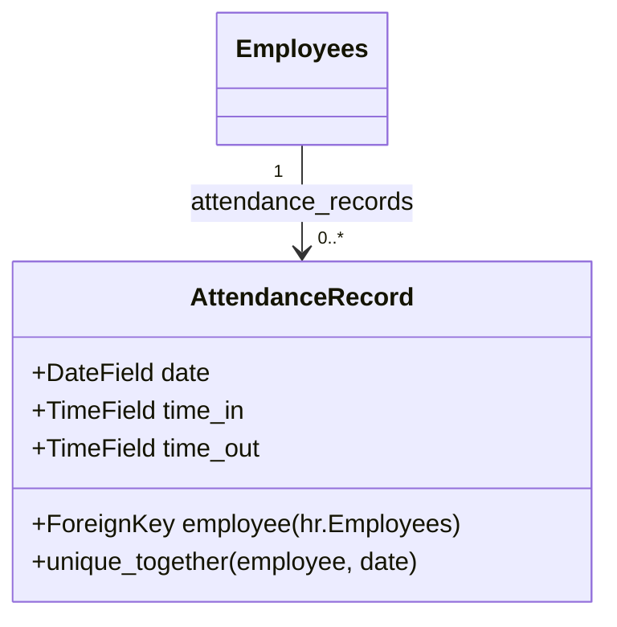
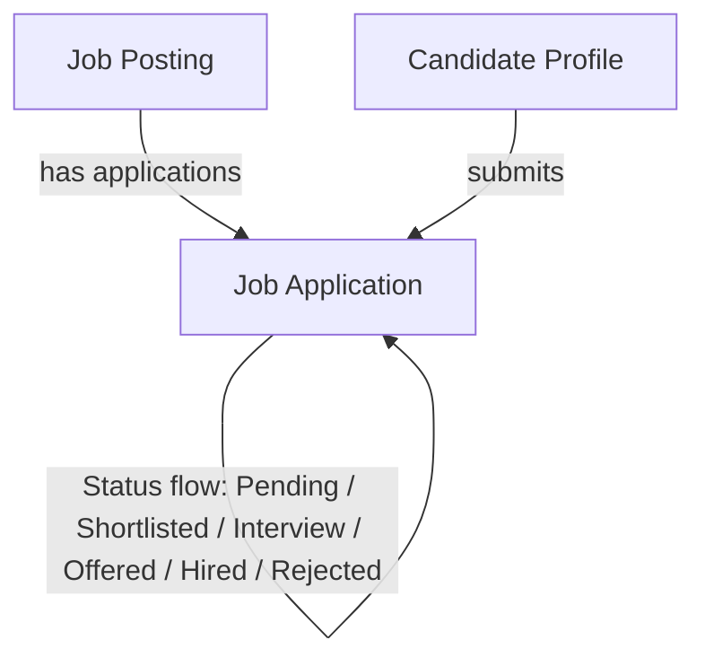

# ZCHPC ERP - Employee Features Guide: Attendance & Job Applications

This guide provides an overview of the Human Resources (HR) sub-modules specifically targeting **Attendance Tracking** and **Recruitment (Job Applications)** in the ZCHPC ERP system.

---

## 1. Attendance Tracking Module

### 1.1 Overview
The Attendance Tracking module records the daily presence of employees. It enables tracking clock-in and clock-out timestamps to ensure accurate payroll calculation and attendance auditing.

### 1.2 Database Schema (`human_resources_attendancerecord`)
- **`employee`** (ForeignKey to `hr.Employees`, CASCADE): Links the record directly to the employee.
- **`date`** (DateField): The calendar day of the attendance record.
- **`time_in`** (TimeField, optional): The time the employee clocked in.
- **`time_out`** (TimeField, optional): The time the employee clocked out.

*Constraint*: A unique constraint exists on `['employee', 'date']`, preventing duplicate entries for the same employee on a single day.

### 1.3 Key Features & Operations
- **Clock-In/Clock-Out Logging**: Frontends capture timestamps and send them to the backend API to record time in and time out.
- **Daily Uniqueness Constraint**: Restricts duplicate logs per employee per day. Updates occur on the same daily record.
- **Ordering**: Automatically orders records by descending date (`-date`) and employee name.

---

## 2. Recruitment & Job Applications Module

### 2.1 Overview
The Recruitment module handles job creation, candidate profiling, and application tracking from submission through shortlisting, interviews, and final placement.

### 2.2 Database Schema
The recruitment sub-system is composed of three interconnected models:

#### A. Job Posting (`human_resources_job`)
- **`title`** (CharField): Job title.
- **`department`** (ForeignKey to `hr.Department`): Department hosting the role.
- **`position`** (ForeignKey to `hr.Position`): The official job position template.
- **`status`** (Choices: `Open`, `Closed`, `Draft`, `Pending`): Control visibility.
- **`salary_usd_*` & `salary_zig_*`** (DecimalFields): Minimum and maximum salary ranges in dual currencies (USD and Zimbabwean Gold ZiG).
- **`responsibilities`, `qualifications`, `competencies`** (JSONFields): Structured lists for job postings.
- **`posted_date`** (DateField): Date when the job went live.

#### B. Candidate (`human_resources_candidate`)
- **`id_number`** (CharField, Unique): National ID or passport number.
- **`first_name` & `last_name`** (CharFields): Candidate's name.
- **`email`** (EmailField, Unique): Candidate's email address.
- **`phone` & `address`** (TextFields): Contact information.
- **`resume`** (FileField, `resumes/`): PDF or Word file uploads.
- **`qualifications` & `experience`** (TextFields): Self-reported text credentials.

#### C. Job Application (`human_resources_jobapplication`)
- **`job`** (ForeignKey to `Job`): Target job posting.
- **`candidate`** (ForeignKey to `Candidate`): Submitting candidate.
- **`cover_letter`** (TextField): Application statement.
- **`status`** (Choices: `Pending`, `Shortlisted`, `Interview`, `Offered`, `Hired`, `Rejected`): The operational workflow state.

*Constraint*: A unique constraint exists on `('job', 'candidate')`, preventing multiple applications by the same candidate for a single job posting.

### 2.3 Operations & Application Workflow
1. **Job Posting**: HR publishes a Job in `'Open'` status with defined department/position ties, dynamic JSON-based responsibilities/competencies lists, and dual-currency salary brackets.
2. **Application Submission**: A Candidate submits personal info, upload resume files, and attaches a cover letter to create a `JobApplication` with `'Pending'` status.
3. **Shortlisting & Screening**: HR reviews resumes and changes the status to `'Shortlisted'`.
4. **Interview Pipeline**: Status escalates to `'Interview'`. Notes are logged on the Candidate's record.
5. **Offering & Hiring**: Upon selecting the candidate, status updates to `'Offered'`. Once accepted, status updates to `'Hired'` and HR converts the Candidate details into a formal `hr.Employees` record.
