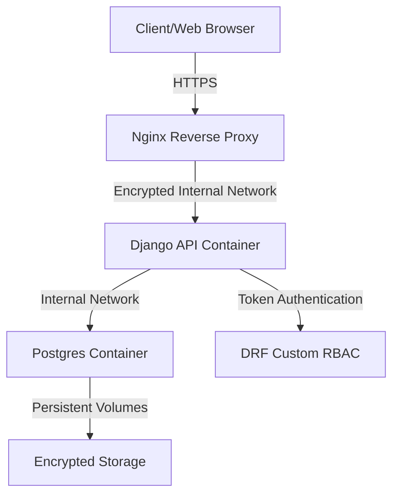

# ZCHPC ERP - Comprehensive Security Research and Guidelines

This document details security analysis, threats, and hardening guidelines for securing an Enterprise Resource Planning (ERP) system, specifically mapped to the ZCHPC ERP architecture.

---

## 1. Executive Summary
Enterprise Resource Planning (ERP) systems consolidate critical business operations, financial data, human resource records, and proprietary intellectual property. Securing an ERP system demands a multi-layered security architecture targeting the host network, container configuration, database access, application logic, and access control policies.

---

## 2. ERP Attack Surface & Threat Modeling

An ERP's data aggregation makes it a high-value target. Major threats include:

### 2.1 Unauthorized Data Access (Data Breaches)
- **Vectors**: Weak authentication, exposed environment files, unsecured API endpoints, missing Object-Level permissions.
- **ZCHPC Context**: Django REST Framework (DRF) serializers exposed without proper permission classes or leaking fields like password hashes or personal identifiable info (PII).

### 2.2 Privilege Escalation & Broken Access Control
- **Vectors**: Role-Based Access Control (RBAC) bypasses, IDOR (Insecure Direct Object Reference).
- **ZCHPC Context**: Inadequate validation of user privileges when accessing endpoints like `/api/v2/hr/employees/` or custom RBAC middleware logic checks.

### 2.3 Injection Attacks
- **Vectors**: SQL Injection (SQLi), Cross-Site Scripting (XSS), Command Injection.
- **ZCHPC Context**: Raw SQL queries bypassing Django's ORM or unsanitized user inputs in recruitment applications/forms rendering dynamically on frontend panels.

### 2.4 Unsecured Docker Infrastructure
- **Vectors**: Root containers, exposed port mapping on `0.0.0.0`, default PostgreSQL credentials, unencrypted container-to-container networks.

---

## 3. Defense-in-Depth Architecture

### 3.1 Network Security & Traffic Hardening
- **Nginx Reverse Proxy**: Always terminate SSL/TLS at Nginx. Avoid direct container port exposure (e.g., only expose ports `80`/`443` on Nginx; keep ports `8000` and `5432` hidden behind the internal network or mapped to localhost loopbacks).
- **Docker Networks**: Use isolated Docker networks (`driver: bridge`). Do not attach unrelated host networks to containers.
- **Host Firewall**: Use `ufw` or `iptables` to block direct host access to ports `8000` (API) and `5433` (PostgreSQL) from outside the corporate subnet.

### 3.2 Container Hardening & Docker Configuration
- **Non-Root Execution**: Configure Dockerfiles to run as a non-privileged system user (e.g., `appuser` in the `appgroup` group).
- **Secrets Management**: Never commit `.env` files to git. Use Docker Secrets or environment variables injected via orchestration (e.g., HashiCorp Vault, AWS KMS) in production.
- **Minimize Image Footprint**: Use slim base images (e.g., `python:3.12-slim`) to minimize installed vulnerabilities (CVEs).

### 3.3 Database Hardening
- **Port Mapping Security**: Do not expose Postgres ports (`5432`/`5433`) globally. Bind strictly to loopback (`127.0.0.1:5433:5432`) or disable ports mapping altogether if external access is unnecessary.
- **Least Privilege Access**: Create dedicated users for migrations and normal app operations with minimum necessary permissions (avoid running Django with superuser DB privileges).

### 3.4 Django & DRF Security Framework
- **JWT (SimpleJWT)**: Implement short lived access tokens (e.g., 5-15 mins) and secure refresh tokens with HttpOnly, Secure, and SameSite cookie flags.
- **RBAC Middleware**: Enforce checking permissions before views execute. Ensure custom permission classes inherit from `rest_framework.permissions.BasePermission` and override `has_permission` and `has_object_permission`.
- **Allowed Hosts**: Explicitly define `ALLOWED_HOSTS` to prevent Host Header Injection attacks. Never use `*` in production.
- **CORS & CSRF**: Restrict `CORS_ALLOWED_ORIGINS` and `CSRF_TRUSTED_ORIGINS` to trusted domains. Do not set `CORS_ALLOW_ALL_ORIGINS = True`.

---

## 4. Verification and Security Auditing
- **Dependency Scanning**: Use tools like `safety check -r requirements.txt` or `npm audit` to detect known vulnerable libraries.
- **Static Analysis (SAST)**: Run `bandit -r erp_project/` to analyze Python code for security issues, and `eslint` for TypeScript frontends.
- **Security Scans**: Use `nikto` or `owasp-zap` against the staging system endpoints to verify header protections (X-Frame-Options, CSP, XSS protection).
